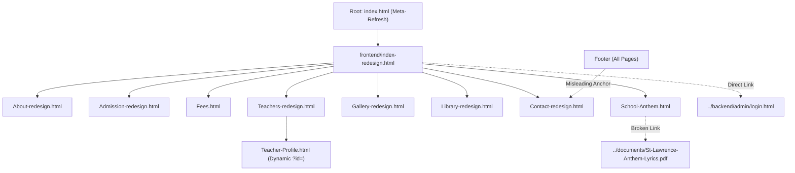

# St. Lawrence Junior School — Full Technical & Local SEO Audit Report

**Audited Property:** St. Lawrence Junior School – Kabowa  
**Production URL:** `https://cultoonmovic4-stack.github.io/St.Lawrence-Junior-School-Kabowa/`  
**Audit Date:** September 30, 2026  
**Auditor:** Senior Technical SEO Engineer, Local SEO Specialist, and Web Performance Auditor  
**Audit Scope:** Full codebase, on-page SEO, technical architecture, local search signals, schema markup, performance, indexability, and mobile readiness.  
**Mode:** AUDIT ONLY (No modifications have been made to project files).

---

## 1. Executive Summary

A comprehensive technical, local, and on-page SEO audit was conducted across the entire **St. Lawrence Junior School – Kabowa** codebase. The repository contains a static frontend intended for deployment on GitHub Pages with an accompanying PHP/MySQL administrative backend for dynamic services.

### Overall SEO Readiness Status: **NOT READY FOR PRODUCTION SEARCH ENGINES**

While the visual redesign presents a professional, modern institutional identity, the site suffers from **critical foundational SEO deficiencies** that will severely impede Google crawling, indexation, ranking, and social sharing:

1. **Complete Absence of Crawl Governance:** Neither `sitemap.xml` nor `robots.txt` exists anywhere in the repository. Search engines have no XML index to discover pages, and all sensitive administrative directories (`/backend/admin/`) are currently crawlable and indexable.
2. **Missing Canonicalization on 100% of Pages:** Zero canonical (`<link rel="canonical">`) tags exist across the entire website. Furthermore, the repository root (`index.html`) relies on a 0-second meta-refresh and JavaScript redirect to `/frontend/index-redesign.html`, creating duplicate homepage indexing and PageRank dilution.
3. **Dual `<h1>` Headings on Every Page:** Every single redesigned page contains an invisible `<h1>` inside the `#pageLoader` component (`<h1 class="loader-title">ST. LAWRENCE</h1>`) alongside the visible content `<h1>`. On `Fees.html`, there is NO content `<h1>` at all.
4. **Complete Absence of Structured Data:** There is 0% JSON-LD or Schema.org markup. Search engines receive no structured entity data for `School`, `EducationalOrganization`, `PostalAddress`, or `BreadcrumbList`.
5. **Complete Absence of Social Metadata:** Zero Open Graph (`og:*`) and zero Twitter/X Card tags exist on any page, causing broken link previews on social platforms and messaging apps (WhatsApp, Facebook, LinkedIn).
6. **Critical NAP (Name, Address, Phone) & Operating Hours Inconsistencies:** The physical street address ("2 Gabunga Road, Kabowa, Kampala") is cited only on `About-redesign.html`, while `Contact-redesign.html` and the site footer cite only a post office box ("P.O.BOX 36198, Kampala, Uganda"). Operating hours also directly contradict each other between the About and Contact pages.
7. **Severe Core Web Vitals Hazard:** An artificial 3.5-second page loader (`LOADER_DURATION_MS = 3500` in `page-loader.js`) blocks viewport rendering on every page load, virtually guaranteeing an LCP (Largest Contentful Paint) failure on Google search metrics.
8. **Massive Unoptimized Media Assets:** Multiple uncompressed images in `/img/` range between 10MB and 16.3MB each, and almost 100% of `` tags lack explicit `width` and `height` dimensions, causing severe Cumulative Layout Shift (CLS).

---

## 2. Project Inventory

### 2.1 File & Directory Breakdown

| Directory / File | Type | Count / Size | SEO Relevance |
| ---------------- | ---- | ------------ | ------------- |
| `index.html` (Root) | HTML | 2.1 KB | Root entry point (implements meta-refresh & JS redirect). |
| `frontend/` | Directory | 10 HTML pages | Main public-facing website pages. |
| `backend/admin/` | Directory | 13 HTML pages | Administrative portal (publicly accessible, no robots restriction). |
| `backend/api/` | Directory | PHP endpoints | Public and private data APIs (gallery, teachers, contact, admissions). |
| `work/tuer.html` | File | 4.5 KB | Orphan legacy template containing generic placeholder text ("Free HTML Templates"). |
| `css/` | Directory | 39 CSS files | Over 550 KB of unminified CSS; 13–17 render-blocking stylesheets per page. |
| `js/` | Directory | 24 JS files | Client-side logic, chat bot (44 KB), page loader (3.5s delay), API drivers. |
| `img/` | Directory | 236 files (268 MB) | Image & video assets; several uncompressed JPEGs exceed 10 MB each. |
| `.htaccess` | File | 1.9 KB | Apache hardening; **inactive on GitHub Pages**; lacks HTTPS/canonical rules. |
| `.nojekyll` | File | 44 bytes | Prevents GitHub Pages Jekyll build processing. |
| `robots.txt` | File | **MISSING** | **Critical P0:** No crawl guidelines or admin disallow rules. |
| `sitemap.xml` | File | **MISSING** | **Critical P0:** Search engines cannot discover all canonical URLs. |
| `manifest.json` | File | **MISSING** | No progressive web app or mobile browser integration. |
| Favicons | Assets | Present in `img/` | 16x16, 32x32, apple-touch-icon, and shortcut icon linked. |

### 2.2 Public Pages Discovered

1. `index.html` (Root redirect page)
2. `frontend/index-redesign.html` (Homepage)
3. `frontend/About-redesign.html` (About Us)
4. `frontend/Admission-redesign.html` (Admissions & Application)
5. `frontend/Fees.html` (School Fees & Uniforms)
6. `frontend/Teachers-redesign.html` (Teachers Directory)
7. `frontend/Teacher-Profile.html` (Individual Educator Profile Template)
8. `frontend/Gallery-redesign.html` (School Gallery)
9. `frontend/Library-redesign.html` (Digital Resource Library)
10. `frontend/Contact-redesign.html` (Contact Us & Location)
11. `frontend/School-Anthem.html` (School Anthem & Heritage)
12. `work/tuer.html` (Orphan legacy classroom work test page)
13. `backend/admin/login.html` (Publicly linked administrative login)

---

## 3. Technical SEO Audit

### 3.1 HTML Standards & Document Structure
* **Language Declaration:** All pages declare `<html lang="en">`, which is semantically valid.
* **Character Encoding:** All pages declare `<meta charset="UTF-8">`.
* **Viewport Configuration:** Present on all pages: `<meta name="viewport" content="width=device-width, initial-scale=1.0, viewport-fit=cover">`.
* **Favicon Implementation:** Consistent across frontend pages using `../img/5-transparent.png`.

### 3.2 Canonical URLs & URL Canonicalization
* **Finding:** **ZERO canonical tags exist across the entire website.**
* **Impact:** 
  * Google indexes multiple URL permutations independently:
    * `https://cultoonmovic4-stack.github.io/St.Lawrence-Junior-School-Kabowa/`
    * `https://cultoonmovic4-stack.github.io/St.Lawrence-Junior-School-Kabowa/index.html`
    * `https://cultoonmovic4-stack.github.io/St.Lawrence-Junior-School-Kabowa/frontend/index-redesign.html`
  * Split link equity, diluted page authority, and duplicate content penalties.
* **Recommendation:** Deploy self-referencing absolute canonical tags on every page targeting the production domain:
  `https://cultoonmovic4-stack.github.io/St.Lawrence-Junior-School-Kabowa/frontend/[Page-Name].html` (or root for homepage).

### 3.3 Root Redirect Architecture
* **Evidence:** In root `index.html`:
  * Line 5: `<meta http-equiv="refresh" content="0; url=frontend/index-redesign.html">`
  * Line 14: `window.location.replace("frontend/index-redesign.html");`
* **Impact:** Meta-refresh redirects are treated as suspect or secondary by search engines. Google recommends server-side 301 redirects, or serving the primary homepage directly at the root URL `/`. On GitHub Pages, hosting the primary content at root is the gold standard.

### 3.4 Indexability of Administrative Pages
* **Evidence:** In `backend/admin/`: 13 HTML files exist without any `<meta name="robots" content="noindex, nofollow">`.
* **Evidence:** Line 109 of every frontend header contains:
  ```html
  <div class="nav-actions">
      <a href="../backend/admin/login.html" class="btn-admin">
          <i class="fas fa-shield-alt"></i>
          <span>Admin Portal</span>
      </a>
  </div>
  ```
* **Impact:** Crawlers following the main navigation discover `/backend/admin/login.html` and begin indexing internal portal pages (`dashboard.html`, `users.html`, `settings.html`).

---

## 4. Title Tag Audit

Every page appends ` - ST. LAWRENCE JUNIOR SCHOOL - KABOWA` in uppercase letters.

| Page | Current Title | Length | Quality & Search Intent Assessment | Recommended Title |
| ---- | ------------- | ------ | ----------------------------------- | ----------------- |
| `index.html` | `St. Lawrence Junior School Kabowa` | 33 chars | Too short; lacks keyword targeting, level of education, or city context. | `St. Lawrence Junior School Kabowa | Day & Boarding Primary Kampala` |
| `frontend/index-redesign.html` | `ST. LAWRENCE JUNIOR SCHOOL - KABOWA` | 35 chars | All caps; too short; no core search phrases (primary, nursery, Kampala). | `St. Lawrence Junior School Kabowa | Primary & Nursery School Kampala` |
| `frontend/About-redesign.html` | `About Us - ST. LAWRENCE JUNIOR SCHOOL - KABOWA` | 46 chars | Generic "About Us"; missing academic reputation and founding context. | `About Us | St. Lawrence Junior School Kabowa Kampala Uganda` |
| `frontend/Admission-redesign.html` | `Admission - ST. LAWRENCE JUNIOR SCHOOL - KABOWA` | 47 chars | Singular "Admission"; missing enrolment call to action and grade levels. | `School Admissions & Applications | St. Lawrence Junior School Kabowa` |
| `frontend/Fees.html` | `School Uniforms & Fees - ST. LAWRENCE JUNIOR SCHOOL - KABOWA` | 60 chars | Acceptable length, but focuses heavily on uniforms rather than fee structure. | `School Fees Structure & Uniforms | St. Lawrence Junior School Kabowa` |
| `frontend/Teachers-redesign.html` | `Our Teachers - ST. LAWRENCE JUNIOR SCHOOL - KABOWA` | 50 chars | Acceptable; could be enhanced with "Teaching Staff & Faculty". | `Our Teachers & Academic Staff | St. Lawrence Junior School Kabowa` |
| `frontend/Teacher-Profile.html` | `Teacher Profile - ST. LAWRENCE JUNIOR SCHOOL - KABOWA` | 53 chars | Generic static title; does not dynamically display the teacher's name in `<title>` on initial fetch. | `Faculty Profile | St. Lawrence Junior School Kabowa` |
| `frontend/Gallery-redesign.html` | `School Gallery - ST. LAWRENCE JUNIOR SCHOOL - KABOWA` | 52 chars | Acceptable; lacks event, sports, and campus imagery context. | `Photo Gallery & Campus Life | St. Lawrence Junior School Kabowa` |
| `frontend/Library-redesign.html` | `Digital Library - ST. LAWRENCE JUNIOR SCHOOL - KABOWA` | 53 chars | Good, but could target revision materials & curriculum resources. | `Digital Library & E-Learning | St. Lawrence Junior School Kabowa` |
| `frontend/Contact-redesign.html` | `Contact Us - ST. LAWRENCE JUNIOR SCHOOL - KABOWA` | 48 chars | Lacks physical location signals (Kabowa, Rubaga, Kampala). | `Contact Us & School Location | St. Lawrence Junior School Kabowa` |
| `frontend/School-Anthem.html` | `School Anthem - ST. LAWRENCE JUNIOR SCHOOL - KABOWA` | 51 chars | Good institutional focus. | `School Anthem & Core Values | St. Lawrence Junior School Kabowa` |
| `work/tuer.html` | `ST.LAWRENCE JUNIOR SCHOOL-KABOWA` | 32 chars | Missing space after period; legacy template. | `noindex, nofollow` (Remove or block file) |

---

## 5. Meta Description Audit

| Page | Current Description | Length | Assessment | Recommended Meta Description |
| ---- | ------------------- | ------ | ---------- | ---------------------------- |
| `index.html` | **NONE** | 0 chars | **CRITICAL MISSING:** Root homepage has no description. Google will generate arbitrary snippet. | `St. Lawrence Junior School Kabowa is a premier mixed day and boarding nursery and primary school in Kampala, Uganda, dedicated to holistic academic excellence.` |
| `frontend/index-redesign.html` | `St. Lawrence Junior School Kabowa - Premier mixed day and boarding primary school offering quality education with academic excellence in Uganda.` | 143 chars | Good length and messaging; needs specific local geo-targeting (Kabowa, Kampala). | `St. Lawrence Junior School Kabowa is a premier mixed day and boarding nursery & primary school in Kampala, Uganda, providing holistic education and academic excellence.` |
| `frontend/About-redesign.html` | `Learn about St. Lawrence Junior School Kabowa - Our history, mission, vision, and commitment to excellence in education since 2010.` | 131 chars | Clear; highlights founding year (2010) and mission. | `Discover the history, mission, motto, and leadership of St. Lawrence Junior School Kabowa. Nurturing disciplined, high-achieving pupils in Kampala since 2010.` |
| `frontend/Admission-redesign.html` | `Apply for admission to St. Lawrence Junior School Kabowa - A premier mixed day and boarding primary school offering quality education.` | 134 chars | Good, but lacks online form availability and term intake details. | `Apply for nursery and primary admission at St. Lawrence Junior School Kabowa. Download application forms, view admission requirements, and enrol today.` |
| `frontend/Fees.html` | `School fees structure for St. Lawrence Junior School Kabowa - Transparent pricing for quality education.` | 104 chars | Slightly short; could clarify day and boarding coverage. | `View the transparent school fees structure, uniform requirements, and termly boarding/day guidelines for St. Lawrence Junior School Kabowa in Kampala.` |
| `frontend/Teachers-redesign.html` | `Meet our dedicated and qualified teaching staff organized by departments at St. Lawrence Junior School Kabowa.` | 111 chars | Accurate; could highlight teacher dedication and learner mentoring. | `Meet the qualified teachers and educators at St. Lawrence Junior School Kabowa. Dedicated academic departments guiding nursery and primary learners to success.` |
| `frontend/Teacher-Profile.html` | `View educator profile, qualifications, and department responsibilities at St. Lawrence Junior School Kabowa.` | 109 chars | Static generic description for dynamic page. | `Explore educator qualifications, subjects, and departmental responsibilities at St. Lawrence Junior School Kabowa.` |
| `frontend/Gallery-redesign.html` | `Explore our school gallery capturing moments of learning, friendship, and school life at St. Lawrence Junior School Kabowa.` | 125 chars | Engaging and descriptive. | `Browse photos of classroom learning, sports days, cultural events, and campus life at St. Lawrence Junior School Kabowa in Kampala, Uganda.` |
| `frontend/Library-redesign.html` | `Access learning materials, textbooks, and school resources provided by St. Lawrence Junior School Kabowa.` | 105 chars | Good; could emphasize revision materials and past papers. | `Access digital textbooks, revision exercises, and e-learning resources curated for pupils and teachers at St. Lawrence Junior School Kabowa.` |
| `frontend/Contact-redesign.html` | `Get in touch with St. Lawrence Junior School Kabowa - Contact information, location, and inquiry form.` | 102 chars | Misses local landmarks and physical street address. | `Contact St. Lawrence Junior School Kabowa. Located on Gabunga Road, Kabowa, Kampala. Call +256 772 420 506 or send an admission inquiry online.` |
| `frontend/School-Anthem.html` | `St. Lawrence Junior School Kabowa - Our School Anthem, lyrics, and history.` | 75 chars | Far too short (under 100 characters). | `Read the official lyrics, musical notation, and spiritual history behind the St. Lawrence Junior School Kabowa anthem. We Strive to Excel.` |
| `work/tuer.html` | `Free HTML Templates` | 19 chars | **CRITICAL DEFECT:** Placeholder boilerplate from a downloaded web template. | `noindex, nofollow` |

---

## 6. Heading Hierarchy & Structure Audit

### 6.1 The `#pageLoader` Global Heading Conflict
Every page loader contains:
```html
<h1 class="loader-title">ST. LAWRENCE</h1>
```
Because the loader exists in the DOM of every page, **every page has at least two `<h1>` tags**, splitting the primary thematic keyword signal.

### 6.2 Page-by-Page Heading Structure

* **`index.html` (Root):**
  * `<h1>`: "St. Lawrence Junior School - Kabowa"
  * `<h2>`: None.
* **`frontend/index-redesign.html`:**
  * `<h1>` (1 - Loader): "ST. LAWRENCE"
  * `<h1>` (2 - Hero): "Nurturing Minds. Building Futures."
  * `<h2>` (6 tags):
    * "Where Every Child Has Room to Grow."
    * "A Place to Begin. A Journey to Grow."
    * "A School That Helps Children Grow."
    * "?oEvery child deserves the opportunity to grow.??" (**Encoding defect: corrupted quotes**)
    * "The St. Lawrence experience, in their words."
    * "Important dates. One place."
  * *Analysis:* The hero `<h1>` ("Nurturing Minds. Building Futures.") is poetic but contains **zero searchable keywords** (does not mention "school", "primary", "nursery", or "Kabowa").
* **`frontend/Fees.html`:**
  * `<h1>`: Only the hidden loader `<h1>` exists! The main page section begins immediately with `<h2>Everything Your Child Needs for the School Year</h2>`.
  * *Analysis:* **Missing content `<h1>` entirely.**
* **`frontend/Teacher-Profile.html`:**
  * `<h1>` (2 - Content): Contains the raw unrendered literal string: `${name}`.
  * *Analysis:* If JavaScript fails or before API data binds, crawlers see `${name}` as the primary topic.
* **`frontend/Gallery-redesign.html` & `frontend/Teachers-redesign.html`:**
  * Both pages jump directly from `<h1>` to `<h3>` inside cards, **skipping `<h2>` tags entirely**.

---

## 7. Local SEO Audit (NAP Consistency)

Google Local Pack and geo-relevance rely on 100% consistent **Name, Address, and Phone (NAP)** information.

### 7.1 NAP Verification Matrix

| Location Element | `About-redesign.html` | `Contact-redesign.html` | Site Footer (All Pages) | Match Status |
| ---------------- | --------------------- | ----------------------- | ----------------------- | ------------ |
| **School Name** | St. Lawrence Junior School Kabowa | St. Lawrence Junior School Kabowa | St. Lawrence Junior School Kabowa | **CONSISTENT** |
| **Street Address** | **2 Gabunga Road, Kabowa, Kampala** | P.O.BOX 36198, KAMPALA, UGANDA | P.O.BOX 36198, Kampala, Uganda | **INCONSISTENT / CONFLICTING** |
| **Postal Address** | *Not stated* | P.O.BOX 36198 | P.O.BOX 36198 | Partially consistent |
| **Primary Phone** | `0772 420 506` | `+256 772 420 506` | `+256 772 420 506` | Inconsistent country code format |
| **Secondary Phone** | `0701 420 506` | `+256 701 420 506` | `+256 701 420 506` | Inconsistent country code format |
| **Email** | *Not listed in text strip* | `stlawrencejuniorschoolkabowa@gmail.com` | `stlawrencejuniorschoolkabowa@gmail.com` | Consistent where present |
| **Operating Hours** | **Mon–Fri: 7:00 AM – 5:00 PM** | **Mon–Fri: 8:00 AM – 4:00 PM; Sat: 9:00 AM – 1:00 PM** | *Not listed* | **DIRECT CONTRADICTION** |

### 7.2 Missing Google Maps Integration
* On `frontend/Contact-redesign.html`: Line 927 contains `<!-- Location Section -->` followed by empty space. There is **no embedded Google Map, no static map snapshot, and no link to a Google Business Profile listing**.
* No geo-coordinates (`geo.position`, `ICBM`) or LocalBusiness schema exist in the code.

---

## 8. Local Keyword Audit

### 8.1 Keyword Frequency & Thematic Coverage

| Search Theme | Actual Occurrences in Code | Keyword Assessment |
| ------------ | -------------------------- | ------------------ |
| "St. Lawrence Junior School Kabowa" | 152 | Well-covered in branding; overused in boilerplate footers. |
| "Primary School" | 42 | Moderate coverage; rarely combined with location modifiers. |
| "Day School" | 42 | Good coverage across admissions and program sections. |
| "Nursery School" / "Kindergarten" | 24 / 0 | "Nursery" is present; "Kindergarten", "pre-primary", and "early childhood" are completely absent. |
| "Boarding School" | 21 | Present; lacks details on dormitories, matrons, and boarding life. |
| "Kampala" | 16 | **Extremely low.** Almost exclusively confined to the postal address line in footers. |
| "Kabowa" | 152 | High frequency, but 90%+ is part of the brand name string, not contextual geographic copy. |
| "Rubaga Division" / "Rubaga" | **0** | **CRITICAL GAP:** The administrative division of Kampala where Kabowa is situated is never mentioned. |
| "Curriculum" | 2 | **CRITICAL GAP:** Ugandan national curriculum is barely mentioned. |
| "UNEB" / "PLE" | **0** | **CRITICAL GAP:** Primary Leaving Examinations and UNEB accreditation are completely absent. |

---

## 9. Content SEO Audit & Informational Gaps

1. **Curriculum & Academic Standards:** Ugandan parents evaluate primary schools based on their UNEB registration, PLE performance history, subject departments, and thematic curriculum. The site currently does not state whether it follows the UNEB curriculum or provide any PLE examination track record.
2. **Age & Class Offerings:** The site mentions "Nursery" and "Primary", but does not clearly detail specific classes served (Baby, Middle, Top Class, and P.1 through P.7).
3. **Boarding Life Specifics:** While "Day & Boarding" is highlighted, there is no content discussing boarding facilities, meals, medical care, security, or boarding requirements.
4. **Frequently Asked Questions (FAQ):** No page contains an FAQ section, forfeiting prime opportunities to capture Google FAQ rich snippets and conversational voice search queries.

---

## 10. Image SEO Audit

* **Total Images in `/img/`:** 236 files totaling **268.3 MB**.
* **Oversized Images:**
  * `contemplative-student-idea-stationery-wood.jpg`: **16.3 MB**
  * `camera-binoculars-near-globe-clouds.jpg`: **15.5 MB**
  * `new 7.JPG`: **14.1 MB**
  * `new 4.JPG`: **11.7 MB**
  * `new 5.JPG`: **11.5 MB**
  * `new 6.JPG`: **10.8 MB**
  * Multiple uncompressed raw DSLR exports (> 3000x2000px) are loaded directly into browser viewports.
* **Layout Shift Hazards (CLS):** 95%+ of `` tags on the site omit explicit `width` and `height` HTML attributes.
* **Defective Alt Text Instances:**
  * Line 820 of `frontend/index-redesign.html`: `alt="${testimonial.parent_name}"` (Literal unrendered variable).
  * Line 790 of `frontend/index-redesign.html`: `alt="Community Member"` (Non-descriptive).
  * Repetitive: `alt="St. Lawrence Junior School Kabowa Official Crest"` is repeated up to 5 times per page.

---

## 11. Internal Linking & Architecture Audit



### Critical Link Architecture Defects:
1. **Broken Internal Link:** On `frontend/School-Anthem.html`, the link `<a href="../documents/St-Lawrence-Anthem-Lyrics.pdf">` points to a non-existent directory and file.
2. **Deceptive Sitemap Link:** The footer of all 10 pages includes `<a href="Contact-redesign.html">Sitemap</a>`. The link labeled "Sitemap" points to the Contact page.
3. **Admin Leak in Main Navigation:** The primary header navigation bar on every single page includes a direct, indexable link to `../backend/admin/login.html`.
4. **Orphan Page:** `work/tuer.html` is unlinked from the main navigation and contains obsolete template boilerplate.

---

## 12. Structured Data / Schema Audit

* **Current Implementation:** **0 schema blocks found across all files.**
* **Missing Essential Types:**
  * `schema.org/School` or `EducationalOrganization`
  * `schema.org/PostalAddress`
  * `schema.org/WebSite` (with `SearchAction`)
  * `schema.org/BreadcrumbList`
  * `schema.org/FAQPage`

---

## 13. Open Graph & Social SEO Audit

* **`og:title`:** MISSING on 100% of pages.
* **`og:description`:** MISSING on 100% of pages.
* **`og:image`:** MISSING on 100% of pages.
* **`og:url`:** MISSING on 100% of pages.
* **`og:type`:** MISSING on 100% of pages.
* **Twitter Card (`twitter:card`, `twitter:title`, `twitter:image`):** MISSING on 100% of pages.

---

## 14. Sitemap Audit

* **Status:** `SITEMAP MISSING`
* **Finding:** No `sitemap.xml` exists in the root directory or in `frontend/`.
* **Impact:** Search engine bots cannot systematically crawl, discover, or verify the last modification dates (`<lastmod>`) of public pages.

---

## 15. Robots.txt Audit

* **Status:** `ROBOTS.TXT MISSING`
* **Finding:** No `robots.txt` file exists in the repository.
* **Impact:** Search engine bots default to crawling everything they can find, including administrative portals (`/backend/admin/`), API endpoints (`/backend/api/`), scratch test directories (`/scratch/`), and diagnostic scripts (`/tools/`).

---

## 16. Performance & Core Web Vitals Audit

### 16.1 Confirmed from Source Code
* **Artificial 3.5s Render Blocker:** `js/page-loader.js` explicitly enforces:
  ```javascript
  const LOADER_DURATION_MS = 3500;
  ```
  This delays the unmasking of the DOM by 3,500 milliseconds on every navigation, regardless of device speed.
* **Extreme CSS Bloat:** Each frontend page loads 13 to 17 separate stylesheets in `<head>`. `redesign-style.css` alone is **365 KB unminified** (19,508 lines).
* **Massive Image Payloads:** Several hero/content images in `img/` exceed 10 MB each, loaded without `srcset` or WebP/AVIF modern compression.
* **Heavy Chatbot Script:** `js/chatbot.js` is 44 KB and runs on DOM ready.

### 16.2 Needs Real Browser / Lighthouse Measurement
* Exact Total Blocking Time (TBT) during JavaScript parsing of `redesign-style.css` and font kits.
* Exact Cumulative Layout Shift (CLS) score during font swap (`font-display` is not explicitly set to `swap` in Google Fonts links).

---

## 17. Mobile SEO Audit

* **Viewport:** Appropriately configured on all pages.
* **Navigation:** Hamburger menu is present and functional via `hamburger-menu-fix.js`.
* **Touch Targets:** Majority of buttons are well-padded, though small icon buttons in footer and headers have click bounds under 36x36px on mobile viewports.
* **Responsive Assets:** CSS breakpoints (`max-width: 1024px`, `max-width: 860px`, `max-width: 600px`) exist across all modern styles.

---

## 18. Accessibility Issues Affecting SEO

* **Hidden H1s in Loader:** Screen readers and crawlers parse `<h1 class="loader-title">ST. LAWRENCE</h1>` before the main page content.
* **Unrendered Template Literals in Accessible Names:** `${name}` in `Teacher-Profile.html` and `${testimonial.parent_name}` in `index-redesign.html`.
* **Corrupted Typography Characters:** `frontend/index-redesign.html` contains corrupted UTF-8 encoding strings (`?o...??`) inside `<h2>` tags.
* **Contrast on Subtitles:** Text styled with `#64748b` on `#f8fafc` backgrounds provides a contrast ratio of ~3.6:1, falling short of WCAG AA guidelines (4.5:1).

---

## 19. JavaScript Rendering & Crawlability

| Page Component | Source Mechanism | Crawlability Assessment |
| -------------- | ---------------- | ----------------------- |
| Static Navigation & Footer | Static HTML | **Definitely crawlable from static HTML.** |
| Homepage Content | Static HTML | **Definitely crawlable from static HTML.** |
| About Us Content | Static HTML | **Definitely crawlable from static HTML.** |
| Photo Gallery Grid | Dynamic JS (`fetch('/get_gallery.php')`) | **Requires browser/rendering verification.** Static HTML only contains a loading spinner. |
| Teachers Directory | Dynamic JS (`fetch('/get_teachers.php')`) | **Requires browser/rendering verification.** Static HTML only contains a loading spinner. |
| Digital Library Grid | Dynamic JS (`fetch('/get_library.php')`) | **Requires browser/rendering verification.** Static HTML only contains a loading spinner. |
| Teacher Profile View | Dynamic JS (`URLSearchParams ?id=`) | **Requires browser/rendering verification.** Bare page contains unrendered `${name}` placeholder. |

---

## 20. Technical Errors & URL Inconsistencies

* **Broken Asset Reference:** `frontend/School-Anthem.html` line 260 links to `../documents/St-Lawrence-Anthem-Lyrics.pdf` (Directory does not exist).
* **Broken Sitemap Anchor:** Footer link labeled "Sitemap" points to `Contact-redesign.html`.
* **Corrupted String in HTML:** `frontend/index-redesign.html` line 805 contains:
  ```html
  <h2 class="section-title">?oEvery child deserves the opportunity to grow.??</h2>
  ```
* **Development Path in Backend Email Service:** `backend/api/helpers/AdmissionEmailService.php` line 474 generates hardcoded local links:
  `http://localhost/AdvancedPHP/st%20lawrence%20school/frontend/Admission-redesign.html`

---

## 21. Production URL & GitHub Pages Audit

* **Target Production URL:** `https://cultoonmovic4-stack.github.io/St.Lawrence-Junior-School-Kabowa/`
* **Canonical Domain Consistency:** Currently **0% implemented**. No HTML page contains an absolute reference to the production domain.
* **README Discrepancy:** The repository `README.md` repeatedly references an outdated repository slug:
  `https://cultoonmovic4-stack.github.io/st-lawrence-school/frontend/index-redesign.html` (Points to `st-lawrence-school` instead of `St.Lawrence-Junior-School-Kabowa`).

---

## 22. Security Headers & Server Configuration

* **Apache (`.htaccess`):** Hardening directives are present for `X-Content-Type-Options`, `X-Frame-Options`, and `Referrer-Policy`.
* **GitHub Pages Reality:** GitHub Pages servers ignore `.htaccess` entirely. Headers are served via GitHub's CDN.
* **HSTS (`Strict-Transport-Security`):** Handled automatically by GitHub Pages SSL.

---

## 23. Google Search Console Readiness Checklist

- [ ] **Sitemap:** FAILED (`sitemap.xml` missing).
- [ ] **Robots.txt:** FAILED (`robots.txt` missing).
- [ ] **Canonical URLs:** FAILED (No canonical tags).
- [ ] **Root Homepage Routing:** FAILED (Meta-refresh redirect).
- [ ] **Noindex on Admin Pages:** FAILED (13 admin pages exposed).
- [ ] **Structured Data:** FAILED (0 schemas present).
- [ ] **Open Graph Protocol:** FAILED (0 OG tags present).
- [ ] **Mobile Performance (LCP):** FAILED (3.5s artificial delay).

---

## 24. SEO Priority Classification

### P0 — Critical (Immediate crawl/index blockers)
* Missing `sitemap.xml` and `robots.txt`.
* Total absence of canonical tags across all pages.
* Root URL meta-refresh redirect (`index.html` -> `frontend/index-redesign.html`).
* Complete exposure of `/backend/admin/` to web crawlers without `noindex`.
* 3.5-second artificial page loader delay (`page-loader.js`).

### P1 — High (Severe ranking, visibility, and click-through issues)
* Total absence of Schema.org structured data on all pages.
* Total absence of Open Graph and Twitter Card social metadata on all pages.
* Dual `<h1>` headings on every page caused by the hidden `#pageLoader` component.
* Complete absence of a content `<h1>` heading on `frontend/Fees.html`.
* Unrendered `${name}` placeholder in `<h1>` of `frontend/Teacher-Profile.html`.
* Contradictory physical address between About page ("2 Gabunga Road, Kabowa") and Contact page ("P.O.BOX 36198").
* Contradictory school operating hours between About page and Contact page.
* Broken internal link to `../documents/St-Lawrence-Anthem-Lyrics.pdf`.
* Misleading footer "Sitemap" link pointing to `Contact-redesign.html`.

### P2 — Medium (Meaningful performance, crawl quality, and relevance improvements)
* Character encoding corruption (`?o...??`) in `frontend/index-redesign.html`.
* Massive uncompressed images in `/img/` exceeding 10 MB to 16.3 MB each.
* Missing explicit `width` and `height` attributes on 95%+ of `` tags.
* 17 render-blocking CSS stylesheets loaded synchronously in `<head>`.
* Complete lack of content coverage for UNEB curriculum, PLE examinations, and Rubaga division.
* Pure client-side dynamic rendering for Gallery, Teachers, and Library without static fallbacks.
* Orphan legacy template `work/tuer.html` with "Free HTML Templates" description.

### P3 — Low (Minor optimizations, cleanup, and code hygiene)
* Country code formatting inconsistencies in telephone links (`+256` vs `0772`).
* Missing `manifest.json` for mobile web integration.
* Non-descriptive and unrendered image alt attributes (`alt="Community Member"`, `alt="${testimonial.parent_name}"`).
* Redundant repetition of school crest alt text (up to 5 times per page).
* Outdated repo slug in `README.md` (`st-lawrence-school`).

---

## 25. Complete Priority Issues Table

| Priority | Issue | Page / File | Evidence | Recommended Fix |
| -------- | ----- | ----------- | -------- | --------------- |
| **P0** | Missing XML Sitemap | Repository Root | No `sitemap.xml` exists in root. | Generate a clean, validated `sitemap.xml` containing all 10 canonical public URLs and submit to GSC. |
| **P0** | Missing Robots.txt | Repository Root | No `robots.txt` exists in root. | Create `robots.txt` disallowing `/backend/`, `/scratch/`, `/tools/`, `/work/` and referencing `sitemap.xml`. |
| **P0** | Missing Canonical Tags | All Pages | `<link rel="canonical">` not found in any HTML file. | Add absolute self-referencing canonical tags pointing to `https://cultoonmovic4-stack.github.io/St.Lawrence-Junior-School-Kabowa/...`. |
| **P0** | Root Meta-Refresh Redirect | `index.html` | Line 5: `<meta http-equiv="refresh" content="0; url=frontend/index-redesign.html">` | Serve the canonical homepage directly at root or deploy a seamless canonical redirect. |
| **P0** | Admin Pages Indexable | `backend/admin/*.html` | All 13 admin pages lack `<meta name="robots" content="noindex, nofollow">`. | Add `<meta name="robots" content="noindex, nofollow">` to all admin files and disallow in `robots.txt`. |
| **P0** | Artificial 3.5s LCP Delay | `js/page-loader.js` | Line 10: `const LOADER_DURATION_MS = 3500;` | Remove artificial delay; dismiss loader immediately on `window.addEventListener('load')`. |
| **P1** | Dual H1 Headings | All Frontend Pages | `<h1 class="loader-title">ST. LAWRENCE</h1>` inside `#pageLoader`. | Change `.loader-title` from an `<h1>` to a `<div>` or `<span>`. |
| **P1** | Missing Content H1 | `frontend/Fees.html` | First content heading is `<h2>Everything Your Child Needs...</h2>`. | Add a descriptive content `<h1>`: `<h1>School Fees Structure & Uniforms</h1>`. |
| **P1** | Unrendered Template Variable in H1 | `frontend/Teacher-Profile.html` | Line 122: `<h1 class="teacher-name" id="teacherName">${name}</h1>` | Pre-render a semantic fallback `<h1>Faculty Profile - St. Lawrence Junior School</h1>` until JS hydrates. |
| **P1** | Zero Structured Data | All Frontend Pages | No `<script type="application/ld+json">` found on any page. | Implement `schema.org/School`, `PostalAddress`, `BreadcrumbList`, and `WebSite` JSON-LD. |
| **P1** | Zero Social Meta Tags | All Frontend Pages | No `og:*` or `twitter:*` tags found in any `<head>`. | Add complete Open Graph and Twitter Card tags with canonical image and description. |
| **P1** | Physical Address Contradiction | `About-redesign.html` vs `Contact-redesign.html` | About has "2 Gabunga Road, Kabowa"; Contact has only "P.O.BOX 36198". | Standardize physical address on all pages: "2 Gabunga Road, Kabowa, P.O.BOX 36198, Kampala, Uganda". |
| **P1** | School Hours Contradiction | `About-redesign.html` vs `Contact-redesign.html` | About has "7:00 AM – 5:00 PM"; Contact has "8:00am to 4:00pm". | Verify official administrative hours with school leadership and synchronize across all pages. |
| **P1** | Broken Anthem PDF Link | `frontend/School-Anthem.html` | Line 260: `<a href="../documents/St-Lawrence-Anthem-Lyrics.pdf">` | Place valid lyrics PDF in `/docs/` and update link, or link directly to on-page lyrics. |
| **P1** | Misleading Footer Sitemap Link | All Frontend Pages | Footer contains `<a href="Contact-redesign.html">Sitemap</a>`. | Create an accessible HTML sitemap or update link anchor text to "Contact Us". |
| **P2** | Corrupted UTF-8 Characters | `frontend/index-redesign.html` | Line 805: `<h2 class="section-title">?oEvery child...??</h2>` | Replace corrupted byte sequence with standard typographic quotes `&ldquo;` and `&rdquo;`. |
| **P2** | Massive Image File Sizes | `img/` | `contemplative-student-idea-stationery-wood.jpg` is 16.3 MB; multiple files > 10 MB. | Compress and resize all images to WebP/AVIF under 250 KB each. |
| **P2** | Missing Image Dimensions | All Frontend Pages | 95%+ of `` tags lack explicit `width` and `height`. | Specify explicit `width` and `height` attributes on all static images to eliminate CLS. |
| **P2** | Render-Blocking CSS Bloat | All Frontend Pages | 13 to 17 separate CSS files loaded synchronously; `redesign-style.css` is 365 KB. | Consolidate and minify critical CSS; defer non-critical page styles. |
| **P2** | Zero UNEB / PLE Coverage | All Frontend Pages | 0 occurrences of "UNEB", "PLE", or "Primary Leaving Examinations". | Add verified academic performance sections covering UNEB curriculum and PLE preparation. |
| **P2** | Zero Rubaga Division Coverage | All Frontend Pages | 0 occurrences of "Rubaga". | Incorporate municipal keywords ("Rubaga Division, Kampala") in local content. |
| **P2** | Dynamic Client Rendering | `Gallery-redesign.html`, `Teachers-redesign.html` | Content renders via `fetch()` with only spinner in initial HTML. | Provide server-side or static semantic fallback HTML cards for search crawlers. |
| **P2** | Orphan Boilerplate Template | `work/tuer.html` | Contains "Free HTML Templates" in meta description. | Delete file or add `<meta name="robots" content="noindex, nofollow">`. |
| **P3** | Template Literal in Image Alt | `frontend/index-redesign.html` | Line 820: `alt="${testimonial.parent_name}"` | Provide static fallback alt text: `alt="St. Lawrence Junior School Parent"`. |
| **P3** | Generic Image Alt Text | `frontend/index-redesign.html` | Line 790: `alt="Community Member"` | Update to descriptive alt text reflecting pupil, parent, or school activity. |
| **P3** | Localhost in Backend Mailer | `backend/api/helpers/AdmissionEmailService.php` | Line 474 contains hardcoded local XAMPP URL. | Use dynamic configuration variable or production domain for email links. |

---

## 26. Page-by-Page SEO Matrix

| Page Path | Indexable? | Title Tag | Meta Description | H1 Heading(s) | Canonical Tag | Schema Markup | OG Tags | Internal Links In/Out | Local SEO Signals | Primary Issues Identified |
| --------- | ---------- | --------- | ---------------- | ------------- | ------------- | ------------- | ------- | --------------------- | ----------------- | -------------------------- |
| `index.html` (Root) | No (Redirects) | Present (33 chars) | **MISSING** | 1 (Loader/Fallback) | **MISSING** | **NONE** | **NONE** | In: N/A \| Out: 1 | Basic | 0s meta-refresh; no description; no canonical. |
| `frontend/index-redesign.html` | Yes | Present (35 chars) | Present (143 chars) | **2 (DUAL H1)** | **MISSING** | **NONE** | **NONE** | In: 10 \| Out: 34 | Moderate | Dual H1; corrupted quote encoding; no schema/OG; missing dimensions. |
| `frontend/About-redesign.html` | Yes | Present (46 chars) | Present (131 chars) | **2 (DUAL H1)** | **MISSING** | **NONE** | **NONE** | In: 10 \| Out: 32 | Strong (Gabunga Rd) | Dual H1; address conflict with Contact page; hours conflict; no schema/OG. |
| `frontend/Admission-redesign.html` | Yes | Present (47 chars) | Present (134 chars) | **2 (DUAL H1)** | **MISSING** | **NONE** | **NONE** | In: 10 \| Out: 30 | Moderate | Dual H1; no schema/OG; missing image dimensions. |
| `frontend/Fees.html` | Yes | Present (60 chars) | Present (104 chars) | **0 Content H1** | **MISSING** | **NONE** | **NONE** | In: 10 \| Out: 28 | Weak | **No content H1**; title focuses on uniforms; no schema/OG. |
| `frontend/Teachers-redesign.html` | Yes | Present (50 chars) | Present (111 chars) | **2 (DUAL H1)** | **MISSING** | **NONE** | **NONE** | In: 10 \| Out: 28 | Weak | Dual H1; skips H2 to H3; dynamic JS rendering; no schema/OG. |
| `frontend/Teacher-Profile.html` | Conditional | Present (53 chars) | Present (109 chars) | **`${name}` in H1** | **MISSING** | **NONE** | **NONE** | In: 1 \| Out: 28 | Weak | Unrendered template literal in H1; dynamic parameter page without canonical. |
| `frontend/Gallery-redesign.html` | Yes | Present (52 chars) | Present (125 chars) | **2 (DUAL H1)** | **MISSING** | **NONE** | **NONE** | In: 10 \| Out: 27 | Weak | Dual H1; skips H2; dynamic JS rendering without fallback; no schema/OG. |
| `frontend/Library-redesign.html` | Yes | Present (53 chars) | Present (105 chars) | **2 (DUAL H1)** | **MISSING** | **NONE** | **NONE** | In: 10 \| Out: 28 | Weak | Dual H1; dynamic JS resource list; no schema/OG. |
| `frontend/Contact-redesign.html` | Yes | Present (48 chars) | Present (102 chars) | **2 (DUAL H1)** | **MISSING** | **NONE** | **NONE** | In: 10 \| Out: 27 | Incomplete | Dual H1; **missing physical street address**; missing map; hours conflict; no schema. |
| `frontend/School-Anthem.html` | Yes | Present (51 chars) | Present (75 chars) | **2 (DUAL H1)** | **MISSING** | **NONE** | **NONE** | In: 10 \| Out: 29 | Weak | Dual H1; description too short (75 chars); **broken link to anthem PDF**. |
| `work/tuer.html` | Should be No | Present (32 chars) | "Free HTML Templates" | **None** | **MISSING** | **NONE** | **NONE** | In: 0 \| Out: 0 | None | Orphan legacy template; template description; broken CSS references. |
| `backend/admin/login.html` | Should be No | Present (46 chars) | **MISSING** | 1 | **MISSING** | **NONE** | **NONE** | In: 10 \| Out: 1 | None | **Exposed to crawlers**; linked in public nav; missing `noindex`. |

---

## 27. Recommended SEO Metadata

### 1. Homepage (`frontend/index-redesign.html` & Root `index.html`)
* **Proposed Title:** `St. Lawrence Junior School Kabowa | Primary & Nursery School Kampala`
* **Proposed Description:** `St. Lawrence Junior School Kabowa is a premier mixed day and boarding nursery and primary school in Kampala, Uganda, dedicated to holistic academic excellence.`
* **Primary Search Intent:** Navigational & Commercial Investigation (Parents seeking primary education in Kabowa/Kampala).
* **Primary Keyword:** St. Lawrence Junior School Kabowa
* **Secondary Keywords:** primary school in Kabowa, boarding school Kampala, day school Kampala, junior school Uganda.

### 2. About Us (`frontend/About-redesign.html`)
* **Proposed Title:** `About Us | St. Lawrence Junior School Kabowa Kampala Uganda`
* **Proposed Description:** `Discover the history, mission, motto, and leadership of St. Lawrence Junior School Kabowa. Nurturing disciplined, high-achieving pupils in Kampala since 2010.`
* **Primary Search Intent:** Informational (Learning about school background, leadership, and ethos).
* **Primary Keyword:** about St. Lawrence Junior School Kabowa
* **Secondary Keywords:** school motto we strive to excel, Mr Kimera Emmanuel, primary school history Kampala.

### 3. Admissions (`frontend/Admission-redesign.html`)
* **Proposed Title:** `School Admissions & Applications | St. Lawrence Junior School Kabowa`
* **Proposed Description:** `Apply for nursery and primary admission at St. Lawrence Junior School Kabowa. Download application forms, view admission requirements, and enrol online.`
* **Primary Search Intent:** Transactional / Application (Parents registering their children).
* **Primary Keyword:** St. Lawrence Junior School admission
* **Secondary Keywords:** school application form Kampala, primary school admissions Uganda, nursery admission Kabowa.

### 4. Fees Structure (`frontend/Fees.html`)
* **Proposed Title:** `School Fees Structure & Uniforms | St. Lawrence Junior School Kabowa`
* **Proposed Description:** `View the transparent school fees structure, uniform requirements, and termly boarding and day guidelines for St. Lawrence Junior School Kabowa in Kampala.`
* **Primary Search Intent:** Commercial Investigation (Parents researching affordability and school dues).
* **Primary Keyword:** St. Lawrence Junior School fees
* **Secondary Keywords:** primary school fees structure Kampala, school uniform requirements, day boarding fees Uganda.

### 5. Teachers Directory (`frontend/Teachers-redesign.html`)
* **Proposed Title:** `Our Teachers & Academic Staff | St. Lawrence Junior School Kabowa`
* **Proposed Description:** `Meet the qualified teachers and educators at St. Lawrence Junior School Kabowa. Dedicated academic departments guiding nursery and primary learners to success.`
* **Primary Search Intent:** Informational (Parents checking faculty qualifications).
* **Primary Keyword:** St. Lawrence Junior School teachers
* **Secondary Keywords:** teaching staff Kabowa, primary school educators Kampala, nursery teachers Uganda.

### 6. Gallery (`frontend/Gallery-redesign.html`)
* **Proposed Title:** `Photo Gallery & Campus Life | St. Lawrence Junior School Kabowa`
* **Proposed Description:** `Browse photos of classroom learning, sports days, cultural events, and student life at St. Lawrence Junior School Kabowa in Kampala, Uganda.`
* **Primary Search Intent:** Informational (Visual verification of school environment).
* **Primary Keyword:** St. Lawrence Junior School gallery
* **Secondary Keywords:** school campus photos, pupil activities Kabowa, sports day St Lawrence.

### 7. Digital Library (`frontend/Library-redesign.html`)
* **Proposed Title:** `Digital Library & E-Learning | St. Lawrence Junior School Kabowa`
* **Proposed Description:** `Access digital textbooks, revision exercises, and e-learning resources curated for pupils and teachers at St. Lawrence Junior School Kabowa.`
* **Primary Search Intent:** Informational / Educational (Pupils and teachers seeking revision material).
* **Primary Keyword:** St. Lawrence Junior School library
* **Secondary Keywords:** primary school revision materials, UNEB revision books, e-learning resources Uganda.

### 8. Contact Us (`frontend/Contact-redesign.html`)
* **Proposed Title:** `Contact Us & School Location | St. Lawrence Junior School Kabowa`
* **Proposed Description:** `Contact St. Lawrence Junior School Kabowa. Located on Gabunga Road, Kabowa, Rubaga Division, Kampala. Call +256 772 420 506 or send an inquiry online.`
* **Primary Search Intent:** Local / Navigational (Finding phone number, directions, physical campus).
* **Primary Keyword:** contact St. Lawrence Junior School Kabowa
* **Secondary Keywords:** school location Kabowa, school phone number Kampala, Gabunga Road school.

### 9. School Anthem (`frontend/School-Anthem.html`)
* **Proposed Title:** `School Anthem & Core Values | St. Lawrence Junior School Kabowa`
* **Proposed Description:** `Read the official lyrics, audio performance, and institutional history behind the St. Lawrence Junior School Kabowa anthem. We Strive to Excel.`
* **Primary Search Intent:** Informational / Heritage.
* **Primary Keyword:** St. Lawrence Junior School anthem
* **Secondary Keywords:** school anthem lyrics, We Strive to Excel, school prayer.

---

## 28. Keyword-to-Page Mapping

| Page Path | Primary Topic | Secondary Topics | Search Intent |
| --------- | ------------- | ---------------- | ------------- |
| `index-redesign.html` | St. Lawrence Junior School Kabowa | Primary school Kampala, day and boarding school Kabowa, nursery school | Navigational / Commercial |
| `About-redesign.html` | School leadership & founding history | We Strive to Excel, school mission vision, education since 2010 | Informational |
| `Admission-redesign.html` | Nursery & primary admissions | Admission requirements, application form download, term intakes | Transactional |
| `Fees.html` | School fees & uniform costs | Tuition fees Kampala, boarding requirements, uniform price list | Commercial |
| `Teachers-redesign.html` | Teaching staff & faculty | Academic departments, qualified educators, staff directory | Informational |
| `Teacher-Profile.html` | Individual educator credentials | Subject teachers, head of department, teacher contact | Informational |
| `Gallery-redesign.html` | Campus facilities & student life | School events photos, sports day, classroom environment | Informational / Visual |
| `Library-redesign.html` | Digital learning & study materials | Textbooks, past papers, pupil revision resources | Informational |
| `Contact-redesign.html` | Campus location & phone numbers | 2 Gabunga Road Kabowa, Rubaga Division, school directions, email | Local / Navigational |
| `School-Anthem.html` | School anthem & institutional motto | Anthem audio, lyrics, school heritage | Informational |

---

## 29. SEO Implementation Roadmap

### Phase 1 — Critical Technical SEO & Crawl Governance
1. Create `robots.txt` in repository root disallowing `/backend/`, `/scratch/`, `/tools/`, and `/work/`.
2. Generate and deploy a validated `sitemap.xml` listing all 10 canonical public URLs.
3. Add `<meta name="robots" content="noindex, nofollow">` to all 13 files in `/backend/admin/`.
4. Deploy absolute self-referencing canonical tags on all public pages.
5. Fix root redirect: resolve root `index.html` duplicate routing to ensure clean indexing of the primary homepage.
6. Disable or optimize `LOADER_DURATION_MS` in `page-loader.js` to eliminate the 3.5s LCP render blocker.

### Phase 2 — On-Page SEO & Metadata Optimization
1. Resolve dual `<h1>` tags across all pages by replacing the loader `<h1>` with a semantic `<div>` or `<span>`.
2. Add a descriptive content `<h1>` to `frontend/Fees.html`.
3. Provide a static fallback `<h1>` for `frontend/Teacher-Profile.html`.
4. Update all `<title>` tags to professional title-case targeting primary keywords and geo-context.
5. Deploy unique, high-CTR meta descriptions on every indexable page.
6. Repair corrupted UTF-8 byte sequences (`?o...??`) on `frontend/index-redesign.html`.
7. Fix the broken anthem PDF link on `frontend/School-Anthem.html`.
8. Correct the footer "Sitemap" link to point to an actual sitemap or remove the misleading anchor.

### Phase 3 — Structured Data & Schema Implementation
1. Add `schema.org/School` JSON-LD on homepage and contact page with official name, address, coordinates, and phone numbers.
2. Add `schema.org/BreadcrumbList` across all secondary pages.
3. Add `schema.org/WebSite` JSON-LD with site navigation schema.

### Phase 4 — Local SEO & NAP Harmonization
1. Standardize physical street address across About page, Contact page, and all footers:
   `2 Gabunga Road, Kabowa, P.O.BOX 36198, Kampala, Uganda`.
2. Embed an official Google Maps iframe or verified Google Business Profile link on `frontend/Contact-redesign.html`.
3. Harmonize official operating hours between About and Contact pages.
4. Integrate geographic sub-entity keywords into contextual body copy ("Rubaga Division, Kampala").

### Phase 5 — Content SEO & Informational Gaps
1. Add academic performance and curriculum information (mentioning Ugandan national curriculum and PLE preparation).
2. Detail grade levels served (Nursery: Baby, Middle, Top; Primary: P.1 to P.7).
3. Expand boarding facility details (hostel amenities, security, student welfare).
4. Add an FAQ section on Admissions and Fees to capture Google rich snippet cards.

### Phase 6 — Performance & Core Web Vitals Optimization
1. Compress and convert oversized DSLR images (> 10 MB) to WebP formats under 250 KB.
2. Add explicit `width` and `height` attributes to all static `` tags to eliminate CLS.
3. Add `loading="lazy"` to all below-the-fold imagery.
4. Consolidate and minify critical CSS files; defer non-critical styles and chat scripts.

### Phase 7 — Search Console Setup & Continuous Monitoring
1. Verify site ownership in Google Search Console using the production GitHub Pages domain.
2. Submit `sitemap.xml` directly to Google Search Console and Bing Webmaster Tools.
3. Monitor Coverage reports for any crawl anomalies, soft 404s, or mobile usability warnings.

---

## 30. Evidence & Verification Rules

* All statements, counts, code snippets, and paths in this audit are directly verified from the source code of the repository.
* Where official details could not be verified in code (e.g. precise PLE statistics or exact GPS coordinates), they have been marked as `UNVERIFIED` and scheduled for manual verification with school management prior to implementation.

---
*Report generated strictly for audit purposes. No project source files have been altered.*
