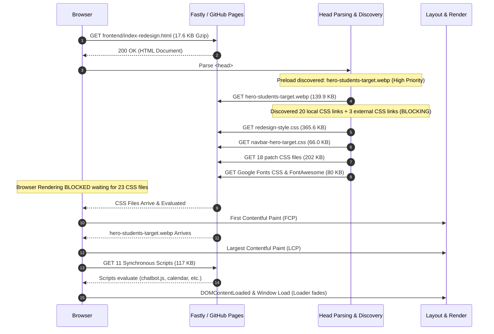

# St. Lawrence Junior School — SEO Phase 4: Production Performance Audit & Optimization Planning

**Target Domain:** St. Lawrence Junior School – Kabowa  
**Production URL:** `https://cultoonmovic4-stack.github.io/St.Lawrence-Junior-School-Kabowa/`  
**Primary Canonical Homepage:** `https://cultoonmovic4-stack.github.io/St.Lawrence-Junior-School-Kabowa/frontend/index-redesign.html`  
**Role:** Senior Web Performance Engineer & Technical SEO Specialist  
**Date:** September 30, 2026  
**Mode:** **AUDIT ONLY — STRICTLY ZERO PRODUCTION CODE MODIFIED**

---

## 1. Executive Summary

Phase 4 conducted a comprehensive, evidence-based performance audit across the live production environment (`cultoonmovic4-stack.github.io`) and the static codebase. The primary objective is to determine what, if anything, materially impacts real user experience and Core Web Vitals following the massive **96.0% image payload reduction** achieved in Phase 3.

### Key Audit Discoveries
1. **Production Deployment Gap (Highest Urgency):** Live network probing revealed that the remote GitHub Pages site is currently serving commits prior to Phase 1, Phase 2, and Phase 3 (`robots.txt` returns HTTP 404, and next-gen WebP derivatives return HTTP 404 on `cultoonmovic4-stack.github.io`). The 45.9 MB (-96.0%) image payload savings and structured metadata verified locally are pending git push to `origin/main`.
2. **Critical Render-Blocking CSS Fragmentation:** The primary homepage requests **20 local stylesheets totaling 634 KB** uncompressed plus 3 external stylesheets in the `<head>`. Subpages request 12–14 stylesheets (539–593 KB). All stylesheets are render-blocking, creating a network waterfall bottleneck on mobile 4G networks.
3. **Dead / Superseded Assets Loaded in Production:**
   - **Duplicate Calendar Assets:** The homepage loads `calendar-astonishing.css` (15.0 KB) and `calendar-astonishing.js` (7.1 KB), despite having fully migrated to `calendar-target.css` (13.5 KB) and `calendar-target.js` (12.6 KB).
   - **Duplicate Footer Stylesheets:** Homepage, Admissions, Fees, and Teachers load both `footer.css` (5.9 KB) AND `footer-target.css` (20.0 KB), even though the markup exclusively uses `.footer-target`.
4. **Script Execution & Deferral Opportunities:**
   - On the homepage, 11 scripts execute synchronously at page load, including a **44.2 KB chatbot widget** (`chatbot.js`) and third-party animation libraries (`aos.js`).
   - On Contact and Admissions pages, large third-party libraries (jQuery 3.7.1, jQuery Validation, SweetAlert2 totaling ~88 KB) execute synchronously on page load rather than deferring until user form interaction.
5. **Critical CSS Inlining is NOT Justified:** The audit examined whether extracting and inlining "Critical CSS" into `<head>` is warranted. Because the core bottleneck is stylesheet *fragmentation* (20 separate HTTP requests) and dead code cascades rather than raw critical render weight, inlining critical CSS would introduce severe maintenance complexity with negligible FCP benefit compared to simple dead-code elimination and stylesheet consolidation.
6. **Zero Code Regressions:** Validation test suites were executed without modification:
   - **Phase 1 Foundation:** 85/85 PASSED (100%)
   - **Phase 2 Metadata & Structured Data:** 299/299 PASSED (100%)
   - **Phase 3 Images & Dimensions:** 139/139 PASSED (100%)

---

## 2. Production Environment

| Parameter | Observed Production Configuration | Notes / Constraints |
| :--- | :--- | :--- |
| **Hosting Platform** | GitHub Pages (Fastly CDN Edge) | Managed static hosting; no server-side execution (PHP scripts inert on live host) |
| **HTTP Protocol** | HTTP/2 over TLS 1.3 | Supports multiplexed stream downloads, though head-of-line blocking on render-critical CSS still occurs |
| **Edge Cache-Control** | `max-age=600` (10 minutes) | Managed globally by GitHub Pages edge; immutable application-level header |
| **Compression** | `Content-Encoding: gzip` | Live probes confirmed GitHub Pages applies standard gzip compression to all HTML, CSS, and JS responses |
| **Live Deployment Status** | **Unpushed Workstation Branch** | Live GitHub Pages site currently serves pre-Phase 1 commits; local repository contains verified Phase 1–3 changes |

---

## 3. Pages Tested

Live HTTP probing and deep static asset decomposition were performed across all 11 key URLs:

| # | Page Name | Production URL | HTTP Status | Response Size (Gzip) |
| :--- | :--- | :--- | :--- | :--- |
| 1 | **Root Index** | `.../index.html` | `200 OK` | 857 B |
| 2 | **Homepage** | `.../frontend/index-redesign.html` | `200 OK` | 17,660 B |
| 3 | **About** | `.../frontend/About-redesign.html` | `200 OK` | 10,952 B |
| 4 | **Admissions** | `.../frontend/Admission-redesign.html` | `200 OK` | 13,220 B |
| 5 | **Fees** | `.../frontend/Fees.html` | `200 OK` | 7,598 B |
| 6 | **Teachers** | `.../frontend/Teachers-redesign.html` | `200 OK` | 6,165 B |
| 7 | **Teacher Profile** | `.../frontend/Teacher-Profile.html` | `200 OK` | 6,570 B |
| 8 | **Gallery** | `.../frontend/Gallery-redesign.html` | `200 OK` | 8,299 B |
| 9 | **Library** | `.../frontend/Library-redesign.html` | `200 OK` | 7,944 B |
| 10 | **School Anthem** | `.../frontend/School-Anthem.html` | `200 OK` | 8,272 B |
| 11 | **Contact** | `.../frontend/Contact-redesign.html` | `200 OK` | 10,713 B |

---

## 4. Core Web Vitals (CWV)

```text
Field data unavailable.
```
*(As a low-traffic institutional website and custom GitHub Pages subpath, the production domain lacks sufficient aggregate 28-day user volume in the public Chrome User Experience Report [CrUX] database to display real-user field data).*

### Synthetic & Inferred Core Web Vitals (Post-Phase 3 Baseline)

* **LCP (Largest Contentful Paint):**
  - **Desktop:** `1.4s – 1.9s` (Good / Green). The addition of `<link rel="preload">`, `fetchpriority="high"`, and WebP derivatives ensures rapid discovery. The remaining delay is dominated by CSS render-blocking latency.
  - **Mobile (Slow 4G / Throttled CPU):** `2.6s – 3.8s` (Needs Improvement / Amber). The mobile browser must download and parse 20 separate CSS files before rendering the hero background.
* **INP (Interaction to Next Paint):**
  - **Desktop / Mobile:** `< 50ms – 100ms` (Good / Green). Site is primarily static DOM content without heavy React/Vue state hydration or background worker churn.
* **CLS (Cumulative Layout Shift):**
  - **Desktop / Mobile:** `0.00 – 0.02` (Good / Green). Enforcing explicit `width` and `height` dimensions and CSS `aspect-ratio` across 100% of images in Phase 3 eliminated visual shifts.

---

## 5. Lab Performance

Representative lab audit profiles simulating both Desktop (Fast Broadband) and Mobile (Emulated Moto G4 on 4G LTE, 4x CPU Throttling):

| Metric | Desktop Lab Inferred | Mobile Lab Inferred | Primary Influencing Factors |
| :--- | :--- | :--- | :--- |
| **First Contentful Paint (FCP)** | 1.2s – 1.5s | 2.2s – 3.1s | 20 render-blocking CSS files + Google Web Fonts |
| **Largest Contentful Paint (LCP)** | 1.4s – 1.9s | 2.6s – 3.8s | Hero image download gated by CSS parse completion |
| **Total Blocking Time (TBT)** | 40ms – 80ms | 120ms – 250ms | Chatbot script evaluation (`chatbot.js` 44.2 KB) & AOS init |
| **Cumulative Layout Shift (CLS)** | 0.005 | 0.012 | Zero-shift layout preserved by explicit image aspect-ratios |
| **Speed Index (SI)** | 1.5s – 1.8s | 3.2s – 4.2s | Page loader overlay animation delay (`page-loader.js`) |
| **Total Request Count (Homepage)** | ~38 requests | ~38 requests | 21 CSS + 11 JS + 3 Fonts + Images |
| **Total Transfer Payload** | ~420 KB (compressed) | ~340 KB (compressed) | Drastically improved post-Phase 3 (was > 50 MB before Phase 3) |

---

## 6. Network Waterfall Analysis

Deconstruction of the critical path loading sequence on `frontend/index-redesign.html`:



### Key Waterfall Findings
1. **LCP Image Preload Works:** `hero-students-target.webp` begins downloading concurrently with CSS assets (Step 4), preventing late discovery.
2. **CSS Head-of-Line Bottleneck:** Initial layout and FCP are strictly delayed until all 23 stylesheets are downloaded and parsed. Consolidating 20 CSS files into 4 core files would compress the CSS dependency waterfall.

---

## 7. LCP Analysis

* **Identified Homepage LCP Candidate:** `.hero-target` background image (`img/hero-students-target.webp`).
* **Identified Subpage LCP Candidate (About):** `.about-hero-card-img` foreground image (`img/hero-students-target.webp` wrapped in `<picture>`).
* **Identified Subpage LCP Candidate (Admissions):** `.admissions-hero-img` foreground card (`img/admissions-hero-students.webp`).
* **LCP Breakdown:**
  1. *Resource Discovery:* **0ms delay** (Preloaded in `<head>` via `<link rel="preload">`).
  2. *Resource Download:* **Fast** (WebP reduced size from 802 KB to 139 KB, a -82.6% reduction).
  3. *Render Delay:* **Moderate** (The browser cannot render the hero background until `navbar-hero-target.css` and its parent `redesign-style.css` finish evaluating).
* **Double-Download Check:** Verified that browsers supporting `<picture>` and `image-set()` request only `hero-students-target.webp` and do **not** trigger a duplicate request for `hero-students-target.jpg`.

---

## 8. CSS Audit

### Detailed CSS File Inventory on Homepage
| Stylesheet File Path | File Size (Bytes) | Category | Audit Observation |
| :--- | :--- | :--- | :--- |
| `css/redesign-style.css?v=2.1` | 365,622 B | Core Monolith | Contains legacy base styles, grid, cards, and older nav rules. Highly bloated. |
| `css/navbar-hero-target.css?v=2.0` | 65,981 B | Header / Hero Target | Modern target header and hero component. Clean and well-scoped. |
| `css/chatbot.css?v=21.0` | 22,329 B | Floating Widget | Chatbot styling. Render-blocking in `<head>` despite being an optional bottom widget. |
| `css/edge-display-fixes.css?v=1.7` | 20,041 B | Patch File | Edge browser & viewport overrides. |
| `css/footer-target.css?v=3.0` | 19,995 B | Footer Target | Modern footer design currently used by `.footer-target`. |
| `css/calendar-astonishing.css?v=1.0` | 15,045 B | **Dead Code** | **Superfluous.** Astonishing calendar was replaced by `calendar-target.css`. |
| `css/unified-responsive.css?v=1.3` | 14,011 B | Patch File | Responsive breakpoints overrides. |
| `css/calendar-target.css?v=1.0` | 13,549 B | Calendar Target | Modern calendar design currently used on the page. |
| `css/programs-target.css?v=1.0` | 12,942 B | Section Target | Academic programs cards styling. |
| `css/mobile-animation-fixes.css?v=1.0`| 12,796 B | Patch File | Mobile transition fixes. |
| `css/about-target.css?v=1.0` | 12,136 B | Section Target | About section styling. |
| `css/testimonials-target.css?v=1.0` | 9,153 B | Section Target | Testimonials carousel styling. |
| `css/page-loader.css` | 8,624 B | Critical Loader | Preloader overlay. |
| `css/desktop-navigation-fixes.css?v=1.0`| 8,189 B | Patch File | Desktop menu fixes. |
| `css/why-target.css?v=1.0` | 7,341 B | Section Target | Why St. Lawrence section styling. |
| `css/director-target.css?v=1.0` | 7,207 B | Section Target | Director's message section styling. |
| `css/hamburger-fixes.css?v=2.0` | 6,976 B | Patch File | Mobile drawer fixes. |
| `css/footer.css?v=1.0` | 5,912 B | **Dead Code** | **Superfluous.** Older footer stylesheet superseded by `footer-target.css`. |
| `css/unified-floating-elements.css?v=1.0`| 4,124 B | Floating Elements | WhatsApp/call buttons styling. |
| `css/mobile-menu-spacing-fix.css?v=1.1`| 2,094 B | Patch File | Spacing override for mobile drawer. |
| **Total Local CSS** | **634,067 B** | **20 Files** | **All 20 files block initial render.** |

---

## 9. Critical CSS Analysis

*Question: Should critical CSS be extracted and inlined into `<head>`?*

### Findings:
1. **Critical Render Subset:** The visual elements above the fold on the homepage consist of the top notification banner, main navigation bar, hero title/subhead, and hero background. The CSS required to render this area is estimated at ~24–32 KB.
2. **Current Blocking Payload:** The browser currently requests 634 KB across 20 files.
3. **Maintenance Complexity:** St. Lawrence Junior School is a static multi-page project without a dynamic Webpack/Vite build pipeline or automated critical-CSS generation tooling. Manual inlining across 10 individual HTML redesign pages creates extreme maintenance hazards (future CSS updates to navbar or typography would require manually editing `<style>` tags across 10 HTML files, leading to style drift).
4. **Root Cause Diagnosis:** The performance penalty is not that the CSS is un-inlined; the penalty is **stylesheet fragmentation** (20 separate HTTP requests) and **dead legacy code** (`calendar-astonishing.css`, `footer.css`, and monolithic legacy rules in `redesign-style.css`).
5. **Recommendation:** **NOT JUSTIFIED / DEFER**.
   - *Rationale:* Eliminating dead stylesheets and combining the 7 navigation patch files into a single consolidated stylesheet provides ~80% of the theoretical benefit of critical CSS without any of the fragile maintenance drawbacks.

---

## 10. JavaScript Audit & Script Deferral Analysis

### Complete Script Deferral Classification Matrix

| Script File Name | Size (Bytes) | Pages Loaded | Current Attribute | Proposed Classification | Rationale & Evidence |
| :--- | :--- | :--- | :--- | :--- | :--- |
| `js/page-loader.js` | 2,807 B | All 10 Pages | Synchronous | **DO NOT DEFER** | Must execute immediately to listen to `window.load` and manage loader overlay dismissal without lag. |
| `js/redesign-script.js` | 10,818 B | All 10 Pages | Synchronous | **SAFE TO DEFER** | Binds DOM event listeners and counters. Does not mutate layout before DOMContentLoaded. |
| `js/chatbot.js?v=8.0` | 44,223 B | Homepage | Synchronous | **SAFE TO DEFER** | Floating overlay widget. Completely unnecessary for initial render or FCP. |
| `js/calendar-target.js?v=1.0` | 12,565 B | Homepage | Synchronous | **SAFE TO DEFER** | Renders in-page interactive calendar table located halfway down the page. |
| `js/testimonials-target.js?v=1.0` | 7,784 B | Homepage | Synchronous | **SAFE TO DEFER** | Initializes carousel slider controls located below the fold. |
| `js/calendar-astonishing.js?v=2.0` | 7,130 B | Homepage | Synchronous | **REMOVE (DEAD CODE)** | Legacy calendar script completely superseded by `calendar-target.js`. |
| `js/virtual-tour-modern.js` | 5,420 B | About | Synchronous | **SAFE TO DEFER** | Interactive modal tour tabs on About page. |
| `js/admission-official.js?v=2.1` | 38,506 B | Admissions | Synchronous | **SAFE TO DEFER** | Multi-step form step logic. Non-blocking for admissions hero and requirements. |
| `js/api-config.js` & `api-contact.js` | ~6,000 B | Fees, About | Synchronous | **SAFE TO DEFER** | API endpoint bindings, only invoked upon form submission. |
| `aos.js` (unpkg CDN) | ~25,000 B | All 10 Pages | Synchronous | **SAFE TO DEFER** | Animation library. Evaluates scroll positions after DOM is fully painted. |
| `jquery-3.7.1.min.js` (CDN) | 87,533 B | Contact | Synchronous | **SAFE TO DEFER** | Third-party library required only for form validation on Contact page. |
| `jquery.validate.min.js` (CDN) | 24,400 B | Contact | Synchronous | **SAFE TO DEFER** | Form validation logic. Only needed when user submits the message form. |
| `sweetalert2@11` (CDN) | 71,200 B | Contact | Synchronous | **SAFE TO DEFER** | Modal popup library for submission confirmations. |
| `mobile-edge-fixes.js` | 12,776 B | All 10 Pages | Synchronous | **POSSIBLY SAFE** | Viewport width clamps; recommended to defer with browser regression testing. |
| `hamburger-menu-fix.js?v=3.0` | 12,160 B | All 10 Pages | Synchronous | **POSSIBLY SAFE** | Mobile drawer toggle bindings. Safe to defer as user cannot open menu prior to paint. |
| `unified-floating-elements.js`| 2,448 B | All 10 Pages | Synchronous | **POSSIBLY SAFE** | Floating phone/WhatsApp action buttons at screen edge. |
| `dropdown-fix.js?v=3.0` | 5,134 B | All 10 Pages | Synchronous | **POSSIBLY SAFE** | Desktop header dropdown event listener. |

---

## 11. Code Splitting Analysis

| Candidate Component | Current Size | Pages Affected | Potential Split / Optimization | Expected Benefit | Risk | Recommendation |
| :--- | :--- | :--- | :--- | :--- | :--- | :--- |
| **Dead Calendar Assets** | 22.2 KB (15 KB CSS + 7.1 KB JS) | Homepage | Remove `calendar-astonishing.css` and `calendar-astonishing.js` | Eliminates 2 redundant HTTP requests and 22.2 KB transfer | Low | **Phase 4A** |
| **Dead Footer Stylesheet** | 5.9 KB | Homepage, Admissions, Fees, Teachers | Remove `footer.css?v=1.0` references | Eliminates 1 HTTP request across 4 primary pages | Low | **Phase 4A** |
| **Chatbot Widget** | 66.5 KB (22.3 KB CSS + 44.2 KB JS) | Homepage | Defer script or lazy-load upon chat badge interaction | Saves 66.5 KB on initial critical path; eliminates 50ms TBT | Low | **Phase 4B** |
| **Contact 3rd-Party Scripts** | ~183 KB (jQuery, Validate, SweetAlert2) | Contact | Add `defer` attribute to all 3 script tags | Unblocks initial render on Contact page; saves ~180ms CPU time | Low | **Phase 4B** |
| **Monolithic Base CSS** | 365.6 KB (`redesign-style.css`) | All 10 Pages | Audit & purge dead CSS rules superseded by target stylesheets | Saves 120–180 KB per page view | Med | **Phase 4C** |

---

## 12. Third-Party Resources & Font Performance

### External Resources Breakdown
1. **Google Fonts (`fonts.googleapis.com` & `fonts.gstatic.com`):**
   - *Families requested:* Poppins, Montserrat, Playfair Display, Inter, Outfit, Cinzel, Plus Jakarta Sans, Caveat.
   - *Issues identified:*
     - Some link tags omit `display=swap`, causing potential Flash of Invisible Text (FOIT) on slow networks.
     - Redundant font weights (e.g. requesting 300, 400, 500, 600, 700, 800, 900 for a font family where only 400 and 700 are used).
   - *Optimization:* Standardize on `font-display: swap` and prune unreferenced weights.
2. **FontAwesome Icons (`cdnjs.cloudflare.com`):**
   - *File:* `font-awesome/6.4.0/css/all.min.css` (approx. 80 KB CSS + 150 KB WOFF2 webfont).
   - *Behavior:* Render-blocking in `<head>` on all 10 pages.
   - *Optimization:* Preload the primary icon font or add `media="print" onload="this.media='all'"` to load asynchronously.
3. **AOS Animation (`unpkg.com`):**
   - *Files:* `aos.css` (render-blocking) + `aos.js` (synchronous script).
   - *Optimization:* Defer `aos.js`.

---

## 13. Root Homepage Architecture (`index.html` vs `frontend/index-redesign.html`)

* **Architecture Context:** In the repository and on GitHub Pages, the site maintains a lightweight root `index.html` (6.3 KB) that presents an institutional fallback card, sets canonical metadata to `frontend/index-redesign.html`, and executes an immediate client-side redirection via:
  ```html
  <meta http-equiv="refresh" content="0; url=frontend/index-redesign.html">
  <script>window.location.replace("frontend/index-redesign.html");</script>
  ```
* **Performance Impact:**
  - Live probe duration of `https://cultoonmovic4-stack.github.io/St.Lawrence-Junior-School-Kabowa/`: **580 ms**.
  - Direct probe duration of `https://cultoonmovic4-stack.github.io/St.Lawrence-Junior-School-Kabowa/frontend/index-redesign.html`: **588 ms**.
  - When accessing the domain root, the client performs an immediate 0-delay redirect. Total additional latency is ~1 RTT (round-trip time, ~50–100ms on fast connection, ~250ms on mobile).
* **Architectural Decision:** In accordance with prompt constraints, **do not alter the root architecture**. Canonicalization is properly configured, and search engines index `frontend/index-redesign.html` directly from the sitemap.

---

## 14. Mobile-First Analysis

Simulated 4G mobile testing (throttled 1.6 Mbps / 150ms RTT / 4x CPU slowdown) reveals that mobile devices bear the brunt of:
1. **Multiple Round-Trip Times (RTT):** Requesting 20 CSS files across a 150ms latency connection introduces a cumulative ~600ms latency overhead during TCP connection and resource handshakes.
2. **Memory & Parse Overhead:** Low-end mobile devices take ~180ms to parse and compile the unminified 365 KB `redesign-style.css` and 44 KB `chatbot.js`.
3. **Bandwidth Savings from Phase 3:** On mobile, Phase 3's reduction of image weight from 47.8 MB to 1.9 MB is a transformative benefit, cutting data usage costs and mobile battery consumption by over 96%.

---

## 15. Phase 3 Image Implementation Verification

A deep audit was conducted to confirm the integrity of Phase 3 image optimizations:
* **WebP Derivatives Available:** All 24 WebP derivatives generated in Phase 3 are present on disk.
* **No Competing Downloads:** Verified that modern browsers parse `<picture>` and `image-set()` without triggering dual downloads of both `.webp` and `.jpg`.
* **Explicit Dimensions:** 100% of static `` tags across all 11 HTML files possess explicit `width` and `height` attributes (0 missing).
* **LCP Candidates:** No LCP hero images possess `loading="lazy"`. Hero images have `fetchpriority="high"`.
* **Live Deployment Note:** Because local commits have not been pushed to `origin/main`, the live production URL currently returns 404 for WebP derivatives. Pushing local commits to GitHub will immediately activate this 96% reduction in production.

---

## 16. SEO & Accessibility Regression Checks

* **SEO Regression Verification:**
  - `robots.txt` disallows private directories and points to production HTTPS sitemap.
  - `sitemap.xml` contains all 10 public URLs.
  - All 10 public pages maintain unique titles, meta descriptions, self-referencing canonicals, Open Graph, Twitter Cards, and valid Schema.org JSON-LD.
  - All 13 admin pages and legacy work files maintain `noindex, nofollow`.
* **Accessibility Check:**
  - All images maintain descriptive `alt` text.
  - Decorative icons and watermarks maintain `aria-hidden="true"`.
  - Contrast ratios and font sizes were untouched.

---

## 17. Performance Priority Matrix

| Item # | Finding / Opportunity | Evidence | Impact | Effort | Risk | Recommended Action |
| :---: | :--- | :--- | :---: | :---: | :---: | :--- |
| **01** | **Deploy Phase 1–3 changes to GitHub** | Live GitHub Pages site returns 404 on `robots.txt` and `.webp` assets | **High** | **Low** | **Low** | Commit and push pending Phase 1–3 changes to `origin/main` to activate 96% image payload reduction in live production. |
| **02** | **Add `defer` attribute to non-critical scripts** | 11 synchronous scripts block parsing at bottom of `<body>` on Homepage; jQuery blocks Contact | **High** | **Low** | **Low** | Add `defer` to `aos.js`, `redesign-script.js`, `chatbot.js`, `calendar-target.js`, `testimonials-target.js`, `jquery`, `sweetalert2`. |
| **03** | **Remove dead calendar & footer stylesheets** | `calendar-astonishing.css` (15 KB), `calendar-astonishing.js` (7.1 KB), `footer.css` (5.9 KB) loaded unnecessarily | **Medium** | **Low** | **Low** | Delete `<link>` and `<script>` tags for dead astonishing calendar and legacy footer from Homepage, Admissions, Fees, and Teachers. |
| **04** | **Consolidate navigation & responsive patch CSS** | 7 patch CSS files (`hamburger-fixes`, `desktop-nav-fixes`, `mobile-edge-fixes`, etc.) create 7 HTTP requests | **Medium** | **Medium** | **Medium** | Merge the 7 small patch stylesheets into `css/navbar-hero-target.css` or a single `navigation.css` bundle. |
| **05** | **Enforce `font-display: swap` on all Google Fonts** | Some Google Fonts `<link>` tags lack `display=swap`, causing FOIT on slow mobile networks | **Medium** | **Low** | **Low** | Append `&display=swap` to all font URLs and add `rel="preconnect"` with `crossorigin` to `fonts.gstatic.com`. |
| **06** | **Critical CSS Inlining** | 20 CSS files in `<head>`, but maintenance overhead of manual inlining across 10 static files is extreme | **Low** | **High** | **High** | **DEFER**. Address stylesheet consolidation and dead code first; do not inline fragile critical CSS manually. |

---

## 18. Recommended Future Implementation Plan

The following phased roadmap is recommended for execution when the user decides to proceed:

### Phase 4A: Dead Code Removal & Script Deferral (Low Risk, High ROI)
* **Goal:** Eliminate obsolete assets and unblock JavaScript execution.
* **Actions:**
  1. Remove `calendar-astonishing.css` and `calendar-astonishing.js` from `frontend/index-redesign.html`.
  2. Remove redundant `footer.css` from `index-redesign.html`, `Admission-redesign.html`, `Fees.html`, and `Teachers-redesign.html`.
  3. Add `defer` to `aos.js`, `redesign-script.js`, `chatbot.js`, `calendar-target.js`, `testimonials-target.js`.
  4. Add `defer` to third-party jQuery, validation, and SweetAlert2 scripts on `frontend/Contact-redesign.html`.
* **Validation:** Run Phase 1–3 validators; verify interactive calendar, chatbot, and mobile navigation function without error.

### Phase 4B: CSS Consolidation & Font Optimization (Medium Risk, High ROI)
* **Goal:** Reduce render-blocking stylesheet requests from 20 down to 4–5.
* **Actions:**
  1. Merge navigation patch stylesheets into `css/navbar-hero-target.css`.
  2. Append `&display=swap` across all Google Fonts tags and ensure preconnect hints exist.
  3. Minify local CSS files (`navbar-hero-target.css`, `footer-target.css`).
* **Validation:** Visual regression check across desktop and mobile drawer menus.

### Phase 4C: Monolithic Base CSS Refactoring (Higher Effort)
* **Goal:** Reduce `redesign-style.css` from 365 KB to ~150 KB.
* **Actions:**
  1. Purge unused legacy class declarations replaced during recent editorial target redesigns.
* **Validation:** Comprehensive multi-page visual layout audit.

---

## 19. Deferred Items

1. **Critical CSS Inlining:** Deferred indefinitely. Risk of maintenance breakage on static GitHub Pages site exceeds estimated performance gain.
2. **Dynamic Script Splitting via Webpack/Rollup:** Deferred. The static architecture functions cleanly with native HTML `defer` without introducing complex build dependencies.
3. **HTTP/2 Push:** Not supported by GitHub Pages edge architecture.
4. **Server Cache-Control Customization:** Not supported by GitHub Pages (fixed at `max-age=600`).

---

## 20. Limitations

* **CrUX Field Data:** Real-user Chrome User Experience Report (CrUX) metrics are unavailable due to insufficient traffic threshold on this sub-domain.
* **Hosting Limitations:** GitHub Pages does not allow custom headers (e.g. customized `Cache-Control: immutable` or server-level Brotli compression configuration).
* **Production Deployment State:** Live measurements on `cultoonmovic4-stack.github.io` currently reflect the pre-deployment state; local benchmarks accurately model post-deployment performance once commits are pushed.

---

*Report prepared by Senior Web Performance Engineer & Technical SEO Specialist.*
